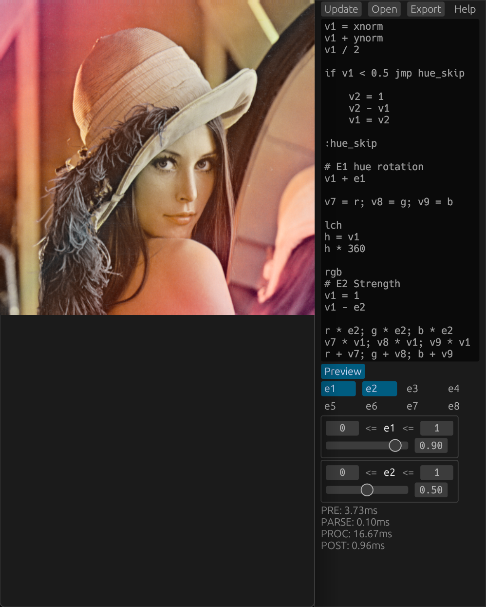

# Pixelbuster 0.2.3
A pixel math library because I can

## Features
  * Tiny core in pure Rust
    * FFI available
    * Fast, works directly on a mutable pointer
  * Simple 100% easy to understand scripting language that definitely will not give you assembly PTSD
    * Kind of turing complete maybe
    * a whole 18 variables you can use, currently limited by the technology of our time.

## Implementations
  * [GIMP plugin here](https://github.com/Beinsezii/bsz-gimp-plugins)
  * a simple GUI can be built with `--features=gui` or found in the releases

## Goals for 1.0
  * SIMD
  * Docs
  * Non-alpha
  * should probably have more than 18 vars
  * the gui looks like it was written by a 14 y/o Minecraft modder
  
## Usage
See the HELP either in [code](./src/lib.rs#L10) or ui for language reference

### As a library
Add this git to `Cargo.toml` and go for it. Basically nothing is documented as most of this is written at around 2 am, but I believe in you nontheless.

There's currently 3 fns available via FFI:

`void pixelbuster_ffi(char* code, char* channels, float* pixels, pixels_len: unsigned int, width: unsigned int);`
  * `code:` Null-terminated UTF-8 string with lines of code
  * `channels:` Null-terminated UTF-8 string with pixel format as letters. Ex: "rgba"
  * `pixels:` Is cast into float* when validated; can point to raw bytes as well
    * Currently must *always* have a 4th channel for alpha
  * `pixels_size:` Size of `pixels` in bytes
  * `width:` Width of image in pixels. Set to 0 if unkown.

`void pixelbuster_ffi_ext(... float e1..float e9);`
 * Same as `pixelbuster_ffi()` with 9 extra floats at the end of the signature to fill out the external variables

`char* pb_help_ffi();`
Simply returns a null-terminated UTF-8 string with HELP

### GUI/GIMP

 1) Type code
 2) Press "update"
 3) Impress mates

## F.A.Q.
Question|Answer
---|---
Couldn't help but notice there's no way to do any complex filters such as a blur. What the hell even is the point of this|Each pixel only has knowledge of itself, as the core operates directly on a provided buffer instead of writing to a 'shadow' buffer then committing changes. Use G'MIC or something idk.
It crashed!|Yup.
